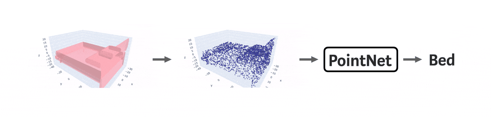
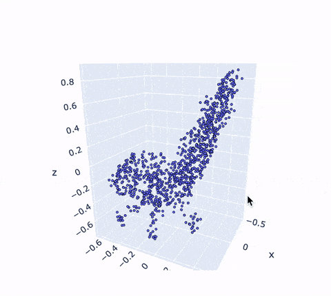

# Object Detection using PointNet
It is point cloud based object detection method. It takes LiDAR Point Cloud as input. 
# PointNet
PyTorch implementation of "PointNet: Deep Learning on Point Sets for 3D Classification and Segmentation" https://arxiv.org/abs/1612.00593


 

Key points of the implementation are explained in details in [this](https://towardsdatascience.com/deep-learning-on-point-clouds-implementing-pointnet-in-google-colab-1fd65cd3a263) Medium article.

## Classification dataset
This code implements object classification on [ModelNet10](https://modelnet.cs.princeton.edu) dataset.

As in the original paper, we sample 1024 points on objects surfaces depending on the area of the current face. Then we normalize the object to a unit sphere and add Gaussian noise. This is an example of input to the neural network that represents a chair:

 

You can download the dataset by following [this link](https://drive.google.com/open?id=12Mv19pQ84VO8Av50hUXTixSxd5NDjeEB)

## Classification performance

| Class (Accuracy) | Overall | Bathtub | Bed| Chair|Desk|Dresser|Monitor|Night stand|Sofa|Table|Toilet|
| :---: |:---: | :---: | :---: | :---: | :---: | :---: | :---: | :---: | :---: | :---: | :---: |
| ModelNet10 | 82.0% | 93.4% | 92.0% | 97.2% | 81.5% | 71.0% | 89.4% | 56.0% |86.9%| 93.4% |95.9%|

Pretrained model is available [here](https://drive.google.com/open?id=1nDG0maaqoTkRkVsOLtUAR9X3kn__LMSL)

## Usage
* The first and the best option is to run the notebook with comments and visualizations `/nbs/PointNetClass.ipynb` in Google Colab.
* The second option is to clone the repository on a local machine and run a model with default parameters:
  If for some reason it doesn't work, you can install the requirements before running `python train.py`:
  ```bash
  conda create -n env python=3.7
  conda activate env
  pip install -r requirements.txt
  ```

## Usage
This part of the project is still in development. However, you already can run the notebook `/nbs/PointNetSeg.ipynb` in Colab.

 
