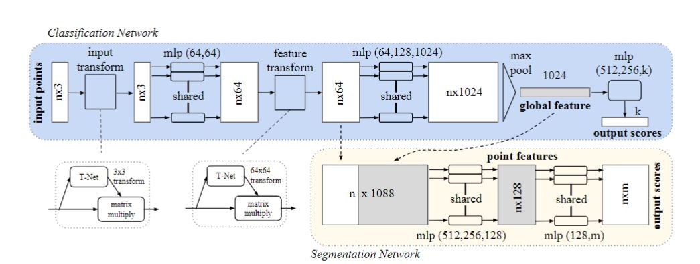
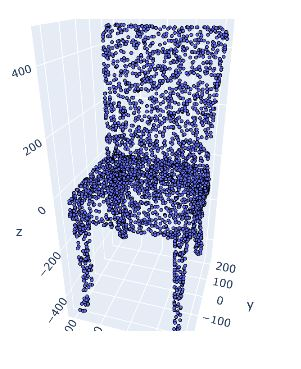
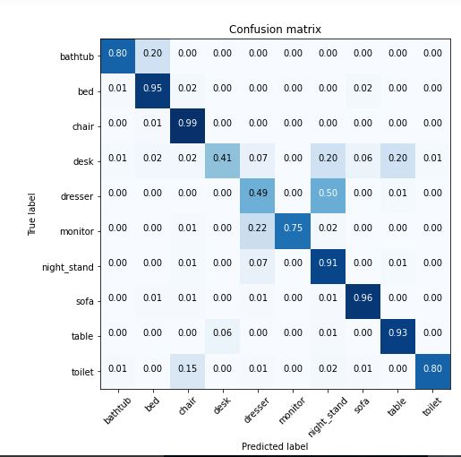
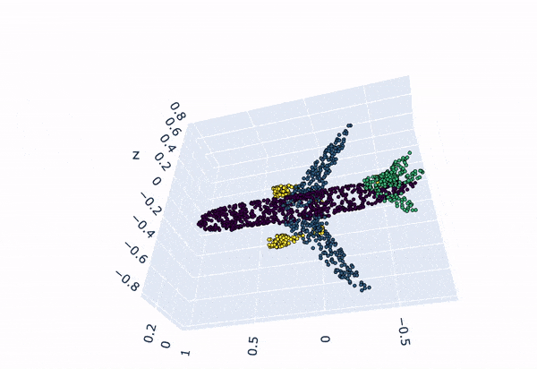

# Object Detection using PointNet
It is point cloud based object detection method. It takes LiDAR Point Cloud as input. 
Point Cloud is the data structure that represents 3D object as the collection of 3D points in the space.

PointNet type of neural network that directly consumes pointclouds, which well respects the permutation invariance of points  in  the  input.
PointNet,  provides a unified architecture for applications ranging from object classification, part segmentation, to scene semantic parsing.I have implemented Object Detection application.

PointNet  is  a  unified  architecture  that  directly takes point clouds as input and outputs either class labels for  the  entire  input  or  per  point  segment/part  labels  for each  point  of  the  input.

The  basic  architecture  of  ournetwork is surprisingly simple as in the initial stages eachpoint  is  processed  identically  and  independently.
Our input format is easy to apply rigid or affine transformations to, as each point transforms independently.
PointNet  is  highly robust  to  small  perturbation  of  input  points  as  well  asto corruption through point insertion and deletion.

# Point Cloud Properties
## Unordered
Point cloud is a set of pointswithout specific order.  In other words, a network that consumes N 3D point sets needs to be invariant to N! permutations of the input set in data feeding order.

## Interaction among points
The  model  needs  to  be  able  to capture  local  structures  from  nearby  points,  and  thecombinatorial interactions among local structures.

## Invariance  under  transformations
As  a  geometricobject,   the  learned  representation  of  the  point  setshould  be  invariant  to  certain  transformations(Rotations,Translation).
It turns out that our network learns to summarize an input point cloud by a sparse set of key  points,  which  roughly  corresponds  to  the  skeleton  of objects according to visualization.


# PointNet
PyTorch implementation of "PointNet: Deep Learning on Point Sets for 3D Classification and Segmentation" https://arxiv.org/abs/1612.00593


 

Key points of the implementation are explained in details in [this](https://towardsdatascience.com/deep-learning-on-point-clouds-implementing-pointnet-in-google-colab-1fd65cd3a263) Medium article.

## PointNet Architecture
 

The classification network takes n points as input, applies input and feature transformations, and then
aggregates point features by max pooling. The output is classification scores for k classes. The segmentation network is an extension to the
classification net.

## Working
The classification network takes N points with its 3D coordinates as input.

Then it applies input and feature transformations, and then aggregates point features by max pooling. 

Train the network with training data and apply optimization during training of the network.

The output is classification scores for k classes.

The segmentation network is an extension to the classification net. It concatenates global and local features and outputs per point scores.

MLP stands for multilayer perceptron, numbers in bracket are layer sizes. 

Batchnorm is used for all layers with ReLU. Dropout layers are used for the last mlp in classification net.


## Classification dataset
This code implements object classification on [ModelNet10](https://modelnet.cs.princeton.edu) dataset.

As in the original paper, we sample 1024 points on objects surfaces depending on the area of the current face. Then we normalize the object to a unit sphere and add Gaussian noise. This is an example of input to the neural network that represents a chair:

 

Point Cloud Representation of the Chair.


Chair Point Cloud after augumentation and addition of Noise.


You can download the dataset by following [this link](https://drive.google.com/open?id=12Mv19pQ84VO8Av50hUXTixSxd5NDjeEB)

## Classification Results

 

| Class (Accuracy) | Overall | Bathtub | Bed| Chair|Desk|Dresser|Monitor|Night stand|Sofa|Table|Toilet|
| :---: |:---: | :---: | :---: | :---: | :---: | :---: | :---: | :---: | :---: | :---: | :---: |
| ModelNet10 | 82.0% | 93.4% | 92.0% | 97.2% | 81.5% | 71.0% | 89.4% | 56.0% |86.9%| 93.4% |95.9%|

Pretrained model is available [here](https://drive.google.com/open?id=1nDG0maaqoTkRkVsOLtUAR9X3kn__LMSL)

## Usage
* The first and the best option is to run the notebook with comments and visualizations `PointNetClass.ipynb` in Google Colab.
* The second option is to clone the repository on a local machine and run a model with default parameters:
  If for some reason it doesn't work, you can install the requirements before running `python train.py`:
  ```bash
  conda create -n env python=3.7
  conda activate env
  pip install -r requirements.txt
  ```

## Usage
Segmentation part of the project is still in development. We can generate similar segmentation results after PointNet Segmentation.

 
